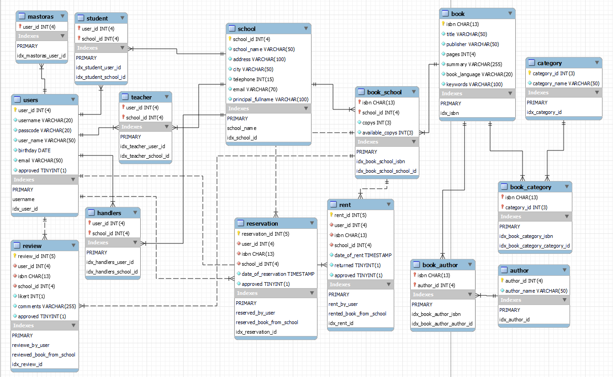
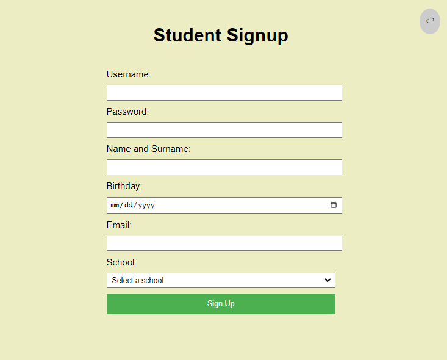
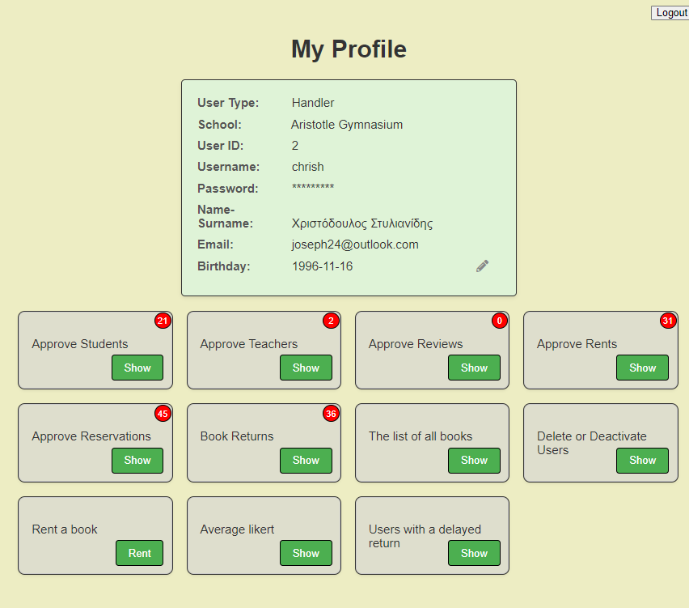
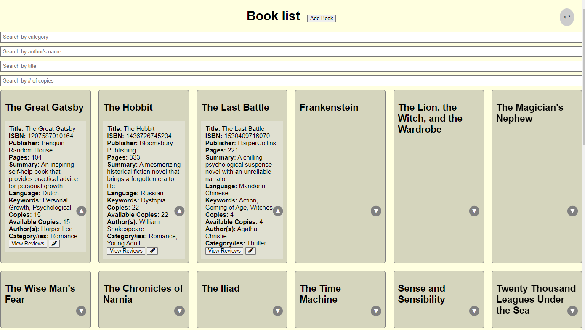
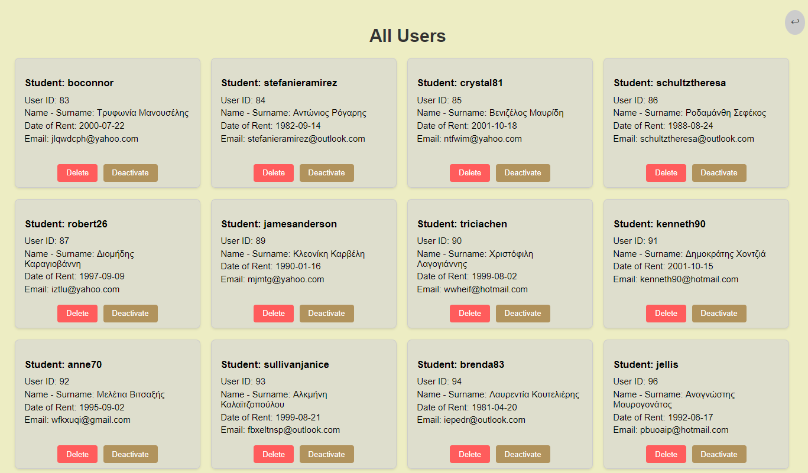

# Papabase
Project for the Databases 2022-2023 class in NTUA ECE that simulates a virtual library.

## Authors
+ Giorgos Pittakis el20605
+ Eracklis Nikolaides el20607
+ Christodoulos Stylianides el20614

## ER Diagram

## Relational Diagram

## Required Imports
All the required tools for the project to work as shown in the requirements.txt are  
> Faker==13.3.4  
> Flask==2.1.1  
> flask==2.3.2  
> Flask-MySQLdb==1.0.1  
> Flask-WTF==1.0.1  
> mysqlclient==2.1.0  
> flask_mysqldb==1.0.1  
> WTForms==3.0.1  
> requests==2.31.0

## Application
The user interface (UI) developed for this simulation allows the user, who is assumed to be a handler, teacher or student to access the results of different queries. Additionally, they have the ability to manipulate the entire database, including creating, updating, and deleting tables related to entities and their relationships.

## User Interface

## Disclaimer
+ The data used in this simulation was generated randomly using the Faker Python library. Any resemblance or correlation to real-world names, phone numbers, etc. is purely coincidental.
